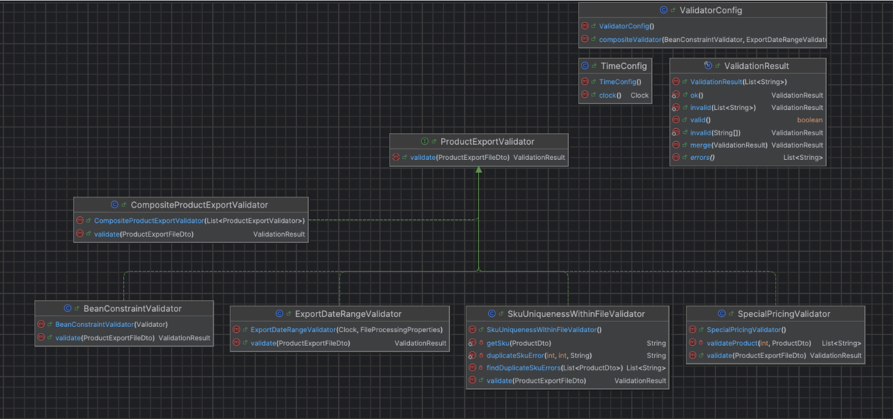

### Goal

The primary goal of the Catalog File Processing Service is to build a robust system for automating the ingestion of product catalog data provided by external partners (suppliers, marketplaces, and B2B clients) who send information as files rather than through an API

### The Processing Pipeline

The main idea is to create a service that manages the entire lifecycle of a catalog file. It consists of:

1. Scanning and Ingestion: Periodically monitoring an input folder for new JSON and CSV files using a scheduled task  
2. Parallel Processing: Using concurrency (ExecutorService or CompletableFuture) to process multiple files simultaneously to ensure efficiency  
3. File Management: Moving successfully processed files to a processed/ directory and routing failed files to a failed/ directory, complete with error logs

Integrity and Validation

1. The system must handle different formats, such as extracting metadata (partner ID and export date) directly from JSON fields or parsing it from the file name convention for CSVs  
2. Every product must pass strict validation rules, such as checking for blank names, ensuring prices are positive, and performing cross-field validation (e.g., ensuring a "special price" is lower than the regular price and that its date range is valid and not in the past)  
3. Results are persisted to a database via Spring Data JPA, with a specific requirement to handle duplicate SKUs by updating existing records rather than creating duplicates

### Tech Stack

* Java 21, Maven, Spring Boot  
* Jackson (jackson-databind) JSON parsing  
* OpenCSV (or manual BufferedReader) CSV parsing  
* java.nio.file: Files, Path, DirectoryStream  
* java.time: Instant, LocalDate, LocalDateTime, ZoneId, Duration  
* java.util.concurrent: ExecutorService, CompletableFuture  
* Spring @Scheduled, Bean Validation (jakarta.validation)  
* Spring Data JPA \+ H2  
* JUnit 5 \+ Mockito  
* Lombok / Records  
* SLF4J \+ Logback

#### Data Model

Each file contains a product export from one partner.

#### JSON format (for example)

{
  "partnerId": "PARTNER-A",
  "exportDate": "2026-03-23T10:30:00Z",
  "products": [
    {
      "name": "Apple Fruit",
      "sku": "802999",
      "price": 41238.0,
      "specialPrice": 35000.0,
      "specialFrom": "2026-03-01",
      "specialTo": "2026-04-01",
      "state": "ACTIVE",
      "brand": "Shelf 3",
      "categories": ["Golden apple Bundles"],
      "imageUrl": "https://img.example.com/apple.jpg"
    }
  ]
}

#### CSV format

Name,SKU,Price,Special Price,Special From,Special To,State,Brand,Category,Image URL
Apple Fruit,802999,41238.0,35000.0,2026-03-01,2026-04-01,ACTIVE,Shelf 3,Golden apple Bundles,https://img.example.com/apple.jpg

**Note: CSV has no partnerId or exportDate, we can get it from the file name convention: products\_PARTNER-A\_2026-03-23.csv**

Fields

| \# | Field | Type | Value |
| :---- | :---- | :---- | :---- |
| 1 | name | String | @NotBlank validation |
| 2 | sku | String | @NotBlank, unique identifier, duplicate handling |
| 3 | price | BigDecimal | @NotNull, @Positive, numeric deserialization |
| 4 | specialPrice | BigDecimal | Optional field, custom validation (must be \< price) |
| 5 | specialFrom | LocalDate | java.time — date parsing, range validation |
| 6 | specialTo | LocalDate | java.time, must be after specialFrom, not in the past |
| 7 | state | Enum | Enum deserialization (ACTIVE/INACTIVE), filtering |
| 8 | brand | String | Maps to Brand entity, optional field handling |
| 9 | category | List | JSON: array; CSV: single Category column wrapped into list |
| 10 | imageUrl | String | @URL validation, optional field |

File-level fields (JSON only and from filename for CSV)

| Field | Type | Validation Rules |
| ----- | ----- | ----- |
| partnerId | String | not blank |
| exportDate | Instant | not in the future, not older than 30 days |

### Implementation Plan

### Step 1\. Environment and Configuration setup

Setting up the Maven dependencies (Jackson, JPA, Validation) and defining the application structure. An important part of this stage is the Application Lifecycle management, where @PostConstruct is used to ensure the necessary input/, processed/, and failed/ directories are created automatically upon startup.

**What to do:**

* Add required dependencies to pom.xml (Jackson, OpenCSV, Spring Data JPA, H2 or PostgreSql, Validation, Lombok)  
* Replace application.properties with application.yml containing:  
  * file-processing.input-dir, processed-dir, failed-dir  
  * file-processing.cron (e.g. "0 \*/1 \* \* \* \*")  
  * file-processing.thread-pool-size  
  * file-processing.max-export-age-days  
  * Datasource config for H2 or PostgreSql  
* Create FileProcessingProperties class with @ConfigurationProperties(prefix \= "file-processing")  
* Create the package structure: config, model, dto, parser, validation, scanner, processor, repository, service, scheduler  
* Ensure data/input/, data/processed/, data/failed/ are created at startup via @PostConstruct

**Skills:**

* Spring Boot configuration, @ConfigurationProperties  
* DI, @PostConstruct

**DoD:**

* Application starts without errors  
* Directories are auto-created on startup  
* Properties are injected and logged at startup

### Step 2\. Modeling and Data Mapping

Creating the Data Transfer Objects (DTOs) using Java Records and defining the JPA Entities (Product, Category) for database persistence. A key technical requirement here is configuring Jackson for both JSON and CSV formats. For JSON, Spring Boot's auto-configured ObjectMapper is extended via JsonMapperBuilderCustomizer (findAndAddModules), so no explicit bean is needed. For CSV, an explicit CsvMapper bean is registered as @Bean("csvObjectMapper") and injected by @Qualifier where needed. This step targets competencies in handling structured data and implementing DI principles

**What to do:**

* Create ProductExportFileDto (record): partnerId, exportDate (Instant), products (List)  
* Create ProductDto (record): all 10 fields from the table above  
* Create enum ProductState: ACTIVE, INACTIVE  
* Create JPA entity Product: id, name, sku, price, specialPrice, specialFrom, specialTo, state, brand, imageUrl, partnerId, sourceFileName, importedAt (Instant)  
* Create JPA entity Category: id, name, @ManyToMany relationship with Product  
* Create ProductRepository extends JpaRepository\<Product, Long\>  
* Configure Jackson in a @Configuration class: use JsonMapperBuilderCustomizer to extend Spring Boot's auto-configured JSON ObjectMapper (findAndAddModules registers JavaTimeModule automatically); register an explicit CsvMapper bean with @Bean("csvObjectMapper") with findAndAddModules and CsvReadFeature.EMPTY_STRING_AS_NULL. Inject the CSV mapper by @Qualifier("csvObjectMapper") where needed

**Skills:**

* Jackson deserialization, java.time types in DTOs  
* JPA entity mapping, Spring Data repositories  
* @Bean, @Qualifier, JsonMapperBuilderCustomizer

**DoD:**

* JSON example deserializes into ProductExportFileDto in a unit test  
* Instant and LocalDate fields deserialize correctly  
* Entity can be saved and read from H2 in a @DataJpaTest

### Step 3\. Parsing Layer

Creates a FileParser interface with distinct implementations for JSON and CSV  
JsonFileParser: Uses standard Jackson deserialization  
CsvFileParser: Uses the FileNameParser to extract metadata (Partner ID and date) from the file name, as these fields are absent in the CSV body. This step implements a Resolver pattern.

**What to do:**

* Define interface FileParser:  
  * ProductExportFileDto parse(Path file)  
  * boolean supports(String fileExtension)  
* Implement JsonFileParser (@Component):  
  * Inject JSON ObjectMapper  
  * Read file with Files.readString(), deserialize with objectMapper.readValue()  
* Create FileNameMetadata (record): partnerId (String), exportDate (LocalDate)  
* Create FileNameParser (@Component):  
  * Extracts partnerId and exportDate from file name convention: products\_PARTNER-A\_2026-03-23.csv  
  * Uses regex pattern, throws IllegalArgumentException if filename doesn't match  
  * Note, single responsibility principle, filename parsing is a separate responsibility from CSV parsing, making both classes independently testable  
* Create CsvProductRow (record): flat DTO matching CSV columns 1:1 and single String category instead of List\<String\>, simplify csv parsing  
* Implement CsvFileParser (@Component):  
  * Constructor-injects @Qualifier("csvObjectMapper") ObjectMapper (CsvMapper) \+ FileNameParser (DIP)  
  * Defines CsvSchema with column names matching CsvProductRow fields, uses withSkipFirstDataRow(true) to skip the header  
  * Uses csvMapper.readerFor(CsvProductRow.class).with(schema).readValues() to parse CSV rows  
  * Maps each CsvProductRow to  ProductDto via toProductDto() and wraps a single category into List\<String\>)  
  * Delegates filename metadata extraction to FileNameParser  
  * CsvMapper with findAndAddModules \+ CsvReadFeature.EMPTY\_STRING\_AS\_NULL handles type conversion and empty fields automatically  
* Create FileParserResolver (@Component):  
  * Inject List\<FileParser\> Spring will do all work for us, collect all implementations  
  * Method FileParser getParser(String extension) \-  iterates, finds the matching parser, throws UnsupportedFileFormatException if none found

Naming note: it's more like a resolver which looks up an existing bean, not a factory which would construct new instances.

**Skills:**

* Strategy pattern \- FileParser interface with different implementations  
* DI with List\<\> injection, @Qualifier("csvObjectMapper") for named bean selection  
* Jackson JSON (ObjectMapper) vs Jackson CSV (CsvMapper \+ CsvSchema), same framework, different format strategies

**DoD:**

* Unit test: JsonFileParser correctly parses a valid JSON file with all field types  
* Unit test: CsvFileParser correctly parses a valid CSV file, single category wrapped into list, dates are parsed  
* Unit test: CsvFileParser extracts partnerId and exportDate from filename  
* Unit test: FileNameParser correctly parses valid filenames and throws for invalid ones  
* Unit test: Resolver returns correct parser for .json and .csv  
* Unit test: Resolver throws exception for .xml

### Step 4\. File Scanner and File Mover

The implementation moves to the java.nio.file API to build a FileScanner and FileMover. These components are responsible for scanning directories and physically moving files to processed/ or failed/ folders based on the result of the processing. This covers the requirement for managing files with language filesystem capabilities

**What to do:**

* Define interface FileScanner:  
  * List\<Path\> scan(Path directory)  
* Implement DirectoryFileScanner (@Component, implements FileScanner):  
  * Uses Files.newDirectoryStream(dir, "\*.{json,csv}"), filters to regular files only, returns sorted list  
  * Note: interface allows future alternative implementations (for example, S3FileScanner) and makes consumers testable via mocking  
* Define interface FileMover:  
  * Path moveToProcessed(Path file)   
  * Path moveToFailed(Path file, String errorMessage)  
  * Methods return the destination Path for logging and testing downstream  
* Implement DefaultFileMover (@Component, implements FileMover):  
  * Constructor-injects FileProcessingProperties to get processedDir / failedDir  
  * moveToProcessed() \- ensures target dir exists, calls Files.move() with REPLACE\_EXISTING  
  * moveToFailed() \- ensures target dir exists, calls Files.move(), writes a .error corresponding file via Files.writeString() containing the error details

**Skills:**

* Java NIO: Files, Path, DirectoryStream  
* File operations: move, write, create directories

**DoD:**

* Unit test: 3 files in a temp directory (2 json, 1 csv) then scanner returns 3 paths  
* Unit test: after moveToProcessed(), file exists in processed dir, not in original location  
* Unit test: after moveToFailed(), file is in failed dir and .error file is created with expected message

### Step 5\. Validation

This step focuses on checking strict rules before any data reaches the database. It uses both standard framework tools and custom logic:

* Uses Bean Validation (@NotBlank, @Positive, etc.) for basic field-level checks on the DTOs  
* The ProductExportValidator implements complex date checks using the java.time API, ensuring the exportDate isn't in the future or excessively old (older than 30 days)  
* Specific logic is implemented to ensure financial data is consistent—for example, a special price must be lower than the regular price, and its associated date range must be logically valid (start before end) and not in the past

**What to do:**

Add Bean Validation annotations to DTOs:

* ProductExportFileDto: @NotBlank partnerId, @NotNull exportDate, @NotEmpty List\<@Valid ProductDto\> products  
* The @Valid inside the list cascades validation into each product  
* ProductDto: @NotBlank name/sku, @NotNull @Positive price, @Positive specialPrice, @NotNull state, @URL imageUrl

Add @Validated to FileProcessingProperties and @Min(1) on maxExportAgeDays and threadPoolSize. Spring Boot validates these at startup and refuses to boot if values are missing or invalid.

Create a ValidationResult record with a single field List\<String\> errors:

* valid() is a method (errors.isEmpty()) but we do not need a stored field  
* Static factories: ok() (cached singleton), invalid(String... errors), invalid(List\<String\> errors)  
* merge(other) combines two results of validation; errors from both are concatenated  
* Constructor uses \`List.copyOf\` to make the list immutable

Create the Composite validation chain:

BeanConstraintValidator checks the annotation validations based on the annotations jakarta.validation.Validator we placed

ExportDateRangeValidator checks that exportDate is not in the future, not older than maxExportAgeDays, and injects Clock for testability

SpecialPricingValidator. If specialPrice is set, then specialFrom/specialTo is required, dates must be ordered, specialPrice \< price

Nice to have (move to the end of the project): SkuUniquenessWithinFileValidator check that there is no duplicate sku within the same file

Create TimeConfig (@Configuration exposes Clock.systemUTC() as a @Bean so time-dependent code is testable with Clock.fixed().

In this implementation, the Composite structural pattern was used. CompositeProductExportValidator has a collection of leaf rules, delegates validate(dto)  to each, and merges the results. The rest of the application sees one ProductExportValidator. The application doesn't know whether validation consists of one rule or all of them.

Rule wiring is explicit: ValidatorConfig (@Configuration) constructs the composite and passes all four rules as an ordered List\<ProductExportValidator\>. The order is intentional: BeanConstraintValidator runs first (catches nulls and blank fields), and next ones are business rules. Adding a new rule means one change in one place in this config. This prevents the composite from accidentally injecting itself without needing a marker interface or runtime filtering.

Each leaf is a Strategy. A different logic for validating the DTO, all changeable behind the same interface. Composite gives the tree, Strategy gives the rules inside it \- one of the most common combos in code.

Chain of Responsibility is also good for validation needs, but CoR passes a request via a chain until one handler fails it. We run every rule unconditionally and collect all errors. It makes more sense for business logic for partners to have a complete report to fix their file in one attempt.

Also, Static Factory Methods and Singleton were used. ValidationResult.ok() returns a cached singleton. ValidationResult.invalid(...) controls construction and in case of empty lists, returns OK. Named factories read clearly and hide the raw constructor from callers.

Dependency Injection via constructor injection: Validator, Clock, FileProcessingProperties, List\<ProductExportValidator\>. Every class is testable without a Spring context.

**DoD:**

* Test: valid DTO \- ValidationResult.valid() is true  
* Test: blank name \- error containing "products\[0\].name:"  
* Test: negative price \- error containing "products\[0\].price:"  
* Test: exportDate in the future \- error  
* Test: exportDate older than 30 days \- error  
* Test: specialPrice present without specialFrom/specialTo \- both errors reported  
* Test: specialPrice \>= price \- error  
* Test: specialPrice set but price is null \- no NPE, price-comparison error is skipped  
* Test: specialFrom not before specialTo \- error  
* Test: duplicate sku in same file \- error with both indexes (if validator was added)  
* Test: composite runs all rules and merges errors from multiple rules

### Step 6\. Persistence Service 

After validation, the ProductImportService manages the transition from transient DTOs to persistent JPA Entities  
This service maps ProductDto to the Product entity, adding system metadata like the importedAt timestamp using Instant.now() and the sourceFileName for auditing  
There is a requirement here to handle duplicate SKU management. Instead of creating duplicate records, the service checks if a SKU already exists for a partner and updates the existing record if found  
The service is responsible for managing the @ManyToMany relationship with the Category entity, finding or creating categories as needed during the import process

**What to do:**

Create ProductImportService (@Service)

Method importProducts(ProductExportFileDto dto, String sourceFileName):

* Map each ProductDto to the Product entity  
* Set importedAt \= Instant.now()  
* Handle categories: find or create Category entities  
* Handle duplicate SKU per partner: update existing product if found  
* Save via repository

**Skills:**

* Spring Data JPA, @Service, @Transactional  
* Entity mapping from DTO  
* Instant.now() for timestamps

**DoD:**

* Integration test (@DataJpaTest): import file DTO and verify products persisted with correct fields  
* Integration test: import the same SKU twice and verify the update, not duplicate row

Steps 5 and 6 covered the "Manipulates date and time with language APIs" and "Handles structured data with libraries" competencies

### Step 7\. Concurrent File Processing

This step introduces the Orchestration layer.   
A SingleFileProcessor is created to manage the full lifecycle of one file: resolving the parser, validating the data, persisting it to the database, and moving the file to the correct folder  
The FileProcessingOrchestrator uses a thread pool (configured via ExecutorService) and CompletableFuture to run these individual file pipelines in parallel  
The requirement is that each file must be independent. A failure or exception in one file must not block or crash the processing of the others  
This step also implements graceful shutdown by using the @PreDestroy annotation to ensure the executor service terminates properly without hanging threads when the application stops

**What to do:**

* Create SingleFileProcessor (@Component), make a full pipeline for one file:  
  * Get file extension, get parser from resolver  
  * Parse the file  
  * Validate the parsed DTO  
  * If valid \- save to DB via ProductImportService, move file to processed/  
  * If invalid \- move file to failed/, write errors to .error file  
  * If exception \- move to failed/, write stack trace to .error file  
  * Return a result object: file name, status (SUCCESS/VALIDATION\_ERROR/PARSE\_ERROR), error list  
* Create FileProcessingOrchestrator (@Service):  
  * Method processAllFiles():  
    1. FileScanner.scan() → list of files  
    2. Submit each file to the thread pool as CompletableFuture\<ProcessingResult\>  
    3. Wait for all with CompletableFuture.allOf()  
    4. Log summary: total / success / failed count  
  * Each file is independent, failure in one must not affect others  
* Configure ExecutorService as a Spring @Bean with configurable pool size  
* Add @PreDestroy to shut down executor gracefully: executor.shutdown() \+ executor.awaitTermination()

**To try:** Try replacing fixed thread pool with Executors.newVirtualThreadPerTaskExecutor() Java 21 virtual threads and compare behavior.

**Skills:**

* **Concurrency**: ExecutorService, CompletableFuture, thread pools  
* Java 21 virtual threads  
* @PreDestroy for graceful shutdown  
* Error in parallel processing

**DoD:**

* Test: 5 files (3 valid \+ 2 invalid) → 3 in processed/, 2 in failed/ with .error files  
* Test: exception during parsing of one file doesn't block processing of other files  
* Test: executor shuts down without hanging threads

### Step 8\. Scheduling and Logging

The FileProcessingScheduler uses the @Scheduled annotation with a cron expression (defined in the application configuration) to trigger the orchestration logic periodically

**What to do:**

* Create FileProcessingScheduler (@Component):  
  * Method annotated with @Scheduled(cron \= "${file-processing.cron}") that calls orchestrator.processAllFiles()  
* Add @EnableScheduling to a configuration class  
* Add SLF4J logging throughout the application:  
  * Startup: configuration summary (directories, cron, pool size)  
  * Each scan: number of files found  
  * Each file: parse/validate/save steps with timing  
  * Errors: file name, field name, error message  
* Create sample test files in data/input/: valid JSON, valid CSV, invalid JSON (missing fields), invalid CSV (bad dates)  
* Run the application end-to-end

**Skills:**

* Spring @Scheduled, cron expressions  
* SLF4J \+ Logback  
* Full integration of all components

**DoD:**

* Application starts, scheduler triggers on cron schedule  
* Valid files end up in processed/, data appears in H2 database  
* Invalid files end up in failed/ with descriptive .error files  
* Logs show complete processing pipeline

## **If time allows**

1. **REST endpoint** \- POST /api/import/trigger to trigger processing manually  
2. **Docker**, containerize the app, use PostgreSql container  
3. **S3 integration** download files from AWS S3 instead of local directory (new Strategy: FileSource interface with LocalFileSource and S3FileSource)